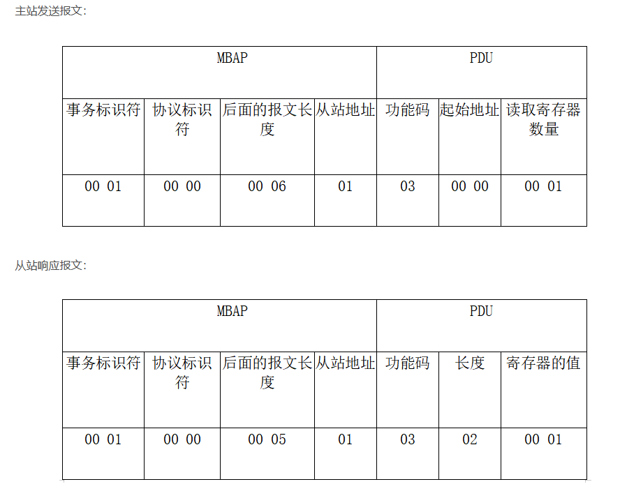

# ModBus学习

## 1. ModBus简介

Modbus是一种应用层协议，由Modicon（现为施耐德电气公司）在1979年开发。Modbus已经成为工业电子设备之间常用的通信协议。

Modbus协议定义了一个控制器（比如PLC）和一台设备（比如HMI、驱动器、传感器等）之间的通信。它是一个请求/响应协议，由主设备（Master）向从设备（Slave）发送请求，从设备接收到请求后进行响应。
Modbus协议支持串行通信（如RS-232、RS-485）和以太网通信（如TCP/IP）。

Modbus协议支持多种数据传输方式，包括RTU（Remote Terminal Unit）和ASCII（American Standard Code for Information Interchange）两种格式。RTU格式使用二进制数据，而ASCII格式使用ASCII字符。

Modbus协议支持多种功能码，用于实现不同的通信功能，如读取保持寄存器、写入单个寄存器、读取输入寄存器等。

Modbus协议还支持多种从设备地址，主设备可以通过从设备地址来识别不同的从设备。

**Modbus**协议是一种广泛使用的工业通信协议，被广泛应用于自动化控制系统、工业自动化设备等领域。

## 2. ModBus协议结构

Modbus协议由以下几部分组成：

1. **地址域**：每个从设备都有一个唯一的地址，主设备通过地址来识别从设备。地址域通常占用1个字节，范围从0到255。
2. **功能码**：功能码用于指定主设备要执行的操作，如读取保持寄存器、写入单个寄存器等。功能码通常占用1个字节。
3. **数据域**：数据域用于传输实际的数据，如寄存器的值、设备的配置信息等。数据域的长度和格式取决于功能码。
4. **校验域**：校验域用于校验数据的完整性和正确性。校验域通常占用2个字节，使用CRC（循环冗余校验）算法进行计算。
   1. CRC校验算法：CRC校验算法是一种常用的数据校验算法，用于检测数据传输过程中的错误。CRC校验算法通过对数据进行多项式除法运算，生成一个校验码，用于校验数据的完整性和正确性。

## 3. ModBus通信方式
Modbus协议支持多种通信方式，包括串行通信和以太网通信。
Modbus-RTU是一种串行通信协议，使用RS-232或RS-485接口进行数据传输。Modbus-RTU协议使用二进制数据格式，数据传输速率较低，适用于短距离通信。
Modbus-ASCII是一种串行通信协议，使用RS-232或RS-485接口进行数据传输。Modbus-ASCII协议使用ASCII字符格式，数据传输速率较低，适用于短距离通信。
Modbus-TCP是一种以太网通信协议，使用TCP/IP协议进行数据传输。Modbus-TCP协议使用二进制数据格式，数据传输速率较高，适用于长距离通信。

### 3.1 串行通信

串行通信是一种通过串行端口进行数据传输的通信方式。Modbus协议支持串行通信，包括RS-232和RS-485两种方式。

RS-232是一种常见的串行通信标准，用于连接计算机和外部设备。RS-232通信使用串行端口进行数据传输，传输速率较低，适用于短距离通信。

RS-485是一种用于工业控制的串行通信标准，用于连接多个设备。RS-485通信使用差分信号进行数据传输，传输速率较高，适用于长距离通信。
### 3.2 以太网通信

以太网通信是一种基于TCP/IP协议的通信方式，用于连接计算机和外部设备。Modbus协议支持以太网通信，包括TCP/IP和UDP/IP两种方式。

TCP/IP通信是一种可靠的网络通信方式，适用于需要可靠传输的应用场景。TCP/IP通信使用TCP协议进行数据传输，具有数据完整性和顺序性。

UDP/IP通信是一种不可靠的网络通信方式，适用于对传输可靠性要求不高的应用场景。UDP/IP通信使用UDP协议进行数据传输，具有较低的延迟和较高的传输速率。
## 4. 通讯过程
 Nodbus是主从方式通讯，主设备发送请求，从设备响应请求。主设备发送的请求包括地址域、功能码和数据域，从设备根据地址域和功能码进行响应，并返回数据域。主设备接收到从设备的响应后，进行解析和处理。

## 5. ModBus协议

### 5.1Modbus -RTU
协议帧 = 地址 + 功能码 +数据 +校验

### 5.2Modbus TCP\IP

MBAP头：包含事务标识符、协议标识符、消息长度、设备地址

Modbus PDU：原始Modbus协议的数据部分，包括功能码、数据地址和数据值。

从上面的报文中我们可以知道：

事务标识符：占2个字节，一次通信的过程中主站和从站的报文帧的事务标识符是一致的。

协议标识符：占2个字节，00 00表示Modbus TCP协议。

后面报文的长度：占2个字节，表示后面报文的长度。

从站地址：占1个字节，表示设备的地址，也就是Salve ID的值。

功能码：占1个字节，例子中的03表示的是读输出寄存器的值。

起始地址：占2个字节，表示从该设备的哪个位置开始读。

读取数量：占2个字节，表示从起始位置往后读的数量。

长度：占2个字节，表示后面还报文的长度。

对应的值：根据不同的存储类型所占的字节不同。

接下来我们通过工具来模拟Modbus TCP通讯。

Modbus协议支持多种功能码，用于实现不同的通信功能。以下是一些常用的Modbus功能码：

1. **读取保持寄存器（Read Holding Registers）**：用于读取从设备的保持寄存器的值。功能码为03。
2. **写入单个寄存器（Write Single Register）**：用于向从设备的单个保持寄存器写入值。功能码为06。
3. **读取输入寄存器（Read Input Registers）**：用于读取从设备的输入寄存器的值。功能码为04。
4. **写入多个寄存器（Write Multiple Registers）**：用于向从设备的多个保持寄存器写入值。功能码为10。
5. **读取线圈状态（Read Coils）**：用于读取从设备的线圈状态的值。功能码为01。
6. **写入单个线圈（Write Single Coil）**：用于向从设备的单个线圈写入状态。功能码为05。
7. **读取离散输入（Read Discrete Inputs）**：用于读取从设备的离散输入状态的值。功能码为02。
8. **读取文件记录（Read File Record）**：用于读取从设备的文件记录。功能码为14。
9. **写入文件记录（Write File Record）**：用于向从设备的文件记录写入数据。功能码为15。
10. **读取异常状态字（Read Exception Status）**：用于读取从设备的异常状态字。功能码为07。

寄存器的值
每个寄存器是 2 字节